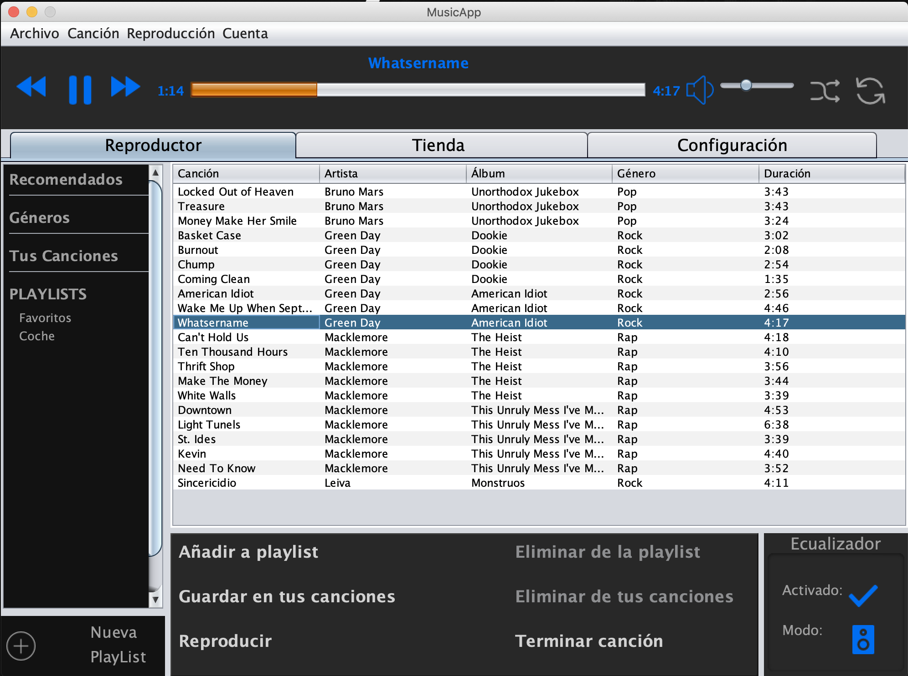
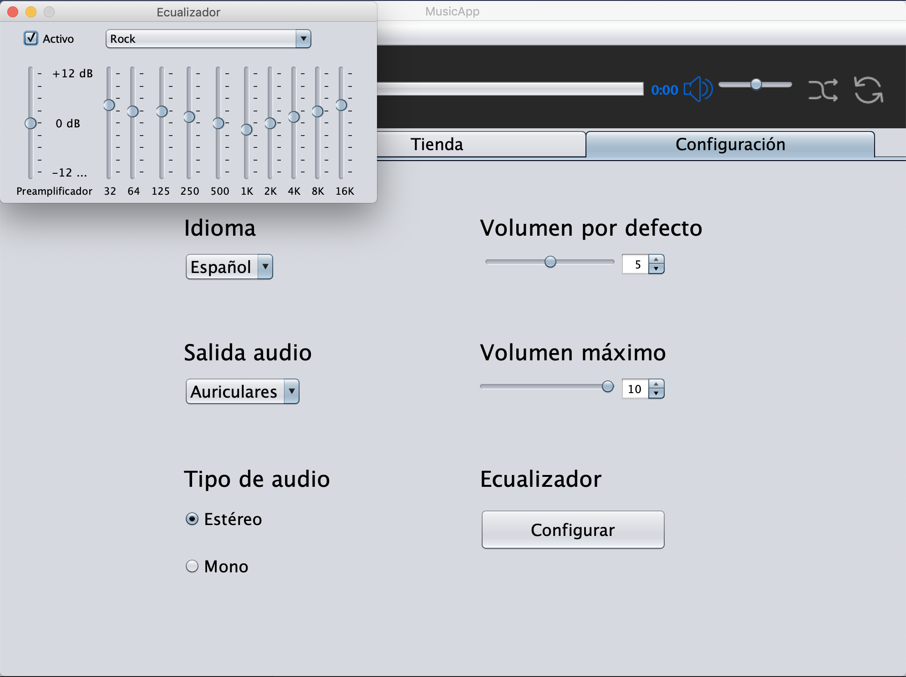
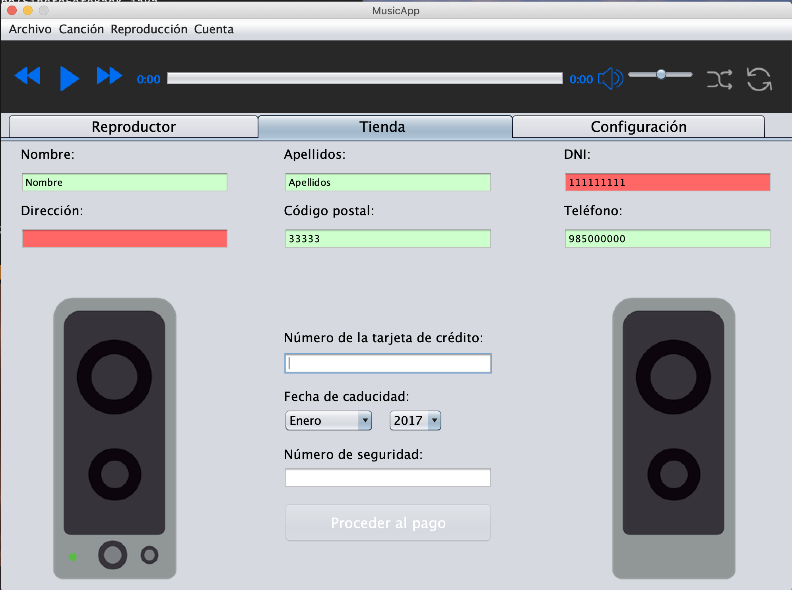
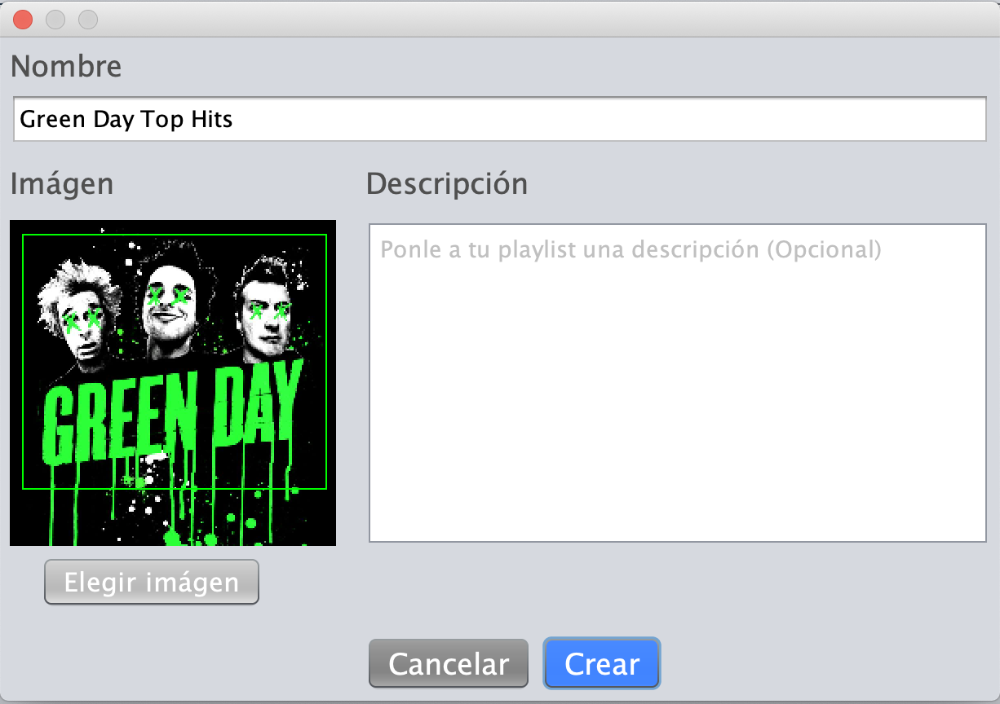

# Music App

  
  

  
  

## What is it?
This project is a desktop application that simulates a Music player, using Java Swing. It doesn't have any real functionality. It is just a UI prototype that was inspired in the Spotify desktop app.

It was developed in the second year of my bachelor's degree for a subject focused on creating User Interfaces.
